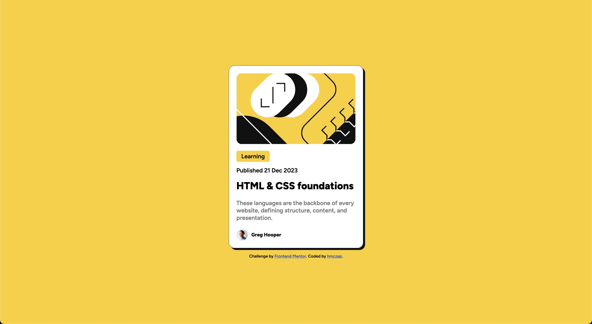
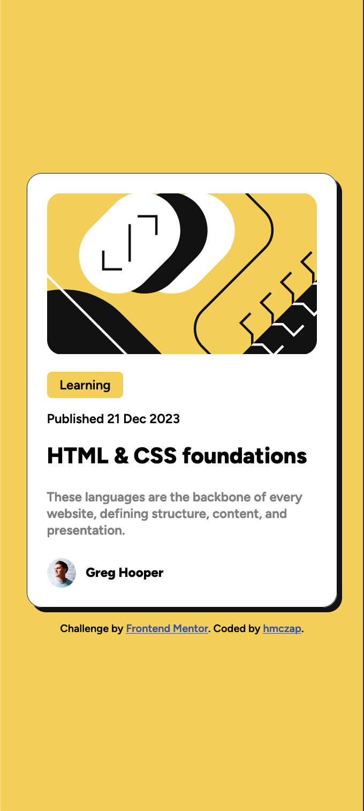

# Frontend Mentor - Blog Preview Card

This is a solution to the [Blog preview card challenge on Frontend Mentor](https://www.frontendmentor.io/challenges/blog-preview-card-ckPaj01IcS). 

## Table of contents

- [Overview](#overview)
  - [The challenge](#the-challenge)
  - [Screenshot](#screenshot)
  - [Links](#links)
- [Author](#author)

## Overview

### The challenge

Users should be able to:

- See hover and focus states for all interactive elements on the page

### Screenshot

### Links

- Solution URL: [https://github.com/hmczap/Blog-preview-card](https://github.com/hmczap/Blog-preview-card)
- Live Site URL: [https://hmczap.github.io/Blog-preview-card/](https://hmczap.github.io/Blog-preview-card/)

## Author

- Frontend Mentor - [@hmczap](https://www.frontendmentor.io/profile/hmczap)